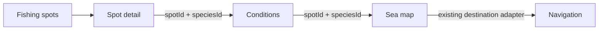

# Fishing Journey Integration V1

The shared URL contract is `spotId`, `speciesId`, `source`, and `returnTo`. `speciesId` is accepted only when it exists in the reviewed 38-species registry. `returnTo` accepts internal Fishing Spots, Conditions, and Sea routes only.

Conditions retains selected spot context when the species changes and updates the URL. Sea restores a permitted fishing spot by `spotId`, displays the optional species context, and never derives a map coordinate or observation station from species data. Navigation continues to use the existing fishing-spot destination adapter and ignores species for coordinate and safety logic.

The four coordinate holds remain spot-ID policies. Blocked map spots never receive focus. Warning spots display with notice. All held spots keep a disabled navigation CTA while Conditions remains available.

At 390px, CTAs use at least `min-h-11`, the map panel clears the BottomNav safe area, and profile/source text wraps inside its cards. This work adds no scoring, ranking, probability, recommendation, safe-route inference, Charter flow, database write, or Supabase write.
