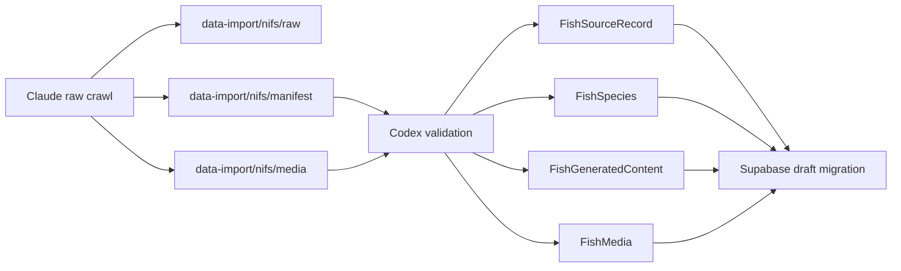

# NIFS Fish Migration Plan

이 문서는 NIFS 어종백과를 Supabase로 옮기기 위한 **실행 전 설계 초안**이다.
실제 migration 적용은 하지 않는다.

## 1. 현재 구조에 대한 판정

### 유지

- `src/data/fish-data.ts`
  - 현재 `/fish`의 실사용 데이터
  - 화면 안정성을 위해 유지
- `src/data/fish/*.ts`
  - `FishInfo` canonical content
- `src/data/regulations/*.ts`
  - 금어기/금지체장 별도 레이어 유지
- `src/data/seo/*.ts`
  - SEO layer 유지
- `src/lib/types/content-contract.ts`
  - Claude 콘텐츠 공통 스키마

### 어댑터로 연결

- `FishSpecies -> FishItem`
- `FishInfo -> canonical fish content`
- `FishingRegulation -> regulation content`
- `SeoArticle -> SEO article content`

### 마이그레이션 대상

- `src/data/fish-data.ts`의 장기 canonicalization
- fish source/version 관리
- AI 생성물과 미디어의 DB 보관

### 폐기 후보

- 현재 없음

## 2. 권장 테이블

### 2.1 `fish_source_records`

원문 수집 단위.

필수:

- PK: `id`
- UNIQUE: `(source_provider, source_id)`

인덱스:

- `content_hash`
- `crawl_status`
- `last_seen_at`

### 2.2 `fish_species`

canonical species master.

필수:

- PK: `id`
- UNIQUE: `slug`

인덱스:

- `scientific_name`
- `korean_name`
- `publish_status`
- `fact_review_status`

### 2.3 `fish_species_sources`

species와 source record 연결.

필수:

- PK: `id`
- UNIQUE: `(fish_species_id, source_record_id)`

### 2.4 `fish_generated_contents`

AI 생성 콘텐츠 저장.

필수:

- PK: `id`
- FK: `fish_species_id`

인덱스:

- `fish_species_id`
- `content_type`
- `generated_at`

### 2.5 `fish_media`

미디어 저장 및 검수.

필수:

- PK: `id`
- FK: `fish_species_id`

인덱스:

- `fish_species_id`
- `media_type`
- `review_status`

### 2.6 `fish_change_logs`

원문 변경 추적.

권장:

- PK: `id`
- FK: `fish_species_id`
- `change_type`
- `changed_at`

### 2.7 `fish_aliases` / `fish_taxonomy`

선택적 정규화 보조 테이블.

## 3. 상태 전이

### crawlStatus

- `pending`
- `crawling`
- `complete`
- `partial`
- `failed`
- `missing`
- `archived`

전이:

- `pending -> crawling -> complete`
- `pending -> crawling -> partial`
- `pending -> crawling -> failed`
- `complete -> missing -> archived`

### factReviewStatus

- `pending`
- `needs_review`
- `approved`
- `rejected`

### mediaReviewStatus

- `pending`
- `needs_review`
- `approved`
- `rejected`

### aiReviewStatus

- `pending`
- `needs_review`
- `approved`
- `rejected`

### publishStatus

- `draft`
- `review`
- `published`
- `hidden`
- `archived`

## 4. upsert 규칙

1. `sourceProvider + sourceId`로 source record를 찾는다.
2. source record가 없으면 새로 만든다.
3. `contentHash`가 같으면 `lastSeenAt`만 갱신한다.
4. `contentHash`가 다르면 새 source version 또는 change log를 남긴다.
5. `FishSpecies`는 `id`와 `slug`로 관리하고, 원본 key와 직접 동일시하지 않는다.
6. 수동 검수된 필드는 원문 변경만으로 자동 덮어쓰지 않는다.
7. `source_missing`은 삭제가 아니라 review flow로 넘긴다.
8. 정상 게시 콘텐츠를 크롤링 실패만으로 자동 비공개하지 않는다.

## 5. slug / 이름 변경 정책

- `slug`는 canonical route key다.
- 이름 변경 시 `aliases`를 유지한다.
- 동일 이름 충돌 시 source와 학명, 검수 내역을 함께 본다.
- 어종명만으로 upsert하지 않는다.

## 6. `/fish` 기존 화면 이행 전략

### 지금

- `/fish`는 `src/data/fish-data.ts`를 직접 사용한다.

### 다음

- `FishSpecies`를 view model로 변환하는 어댑터 추가
- 기존 화면이 그대로 동작하도록 legacy field shape 유지

### 이후

- `/fish/[slug]` 상세 라우트 신설
- `/fish` 목록은 탐색과 필터링에 집중

## 7. Claude staging -> Codex ingest 흐름

## 8. 예상 위험

### 가장 큰 충돌 위험

1. `src/data/fish-data.ts`를 canonical source로 계속 쓰는 동안
   새 `FishSpecies`와 이중 관리가 발생할 수 있다.
2. `sourceProvider + sourceId`와 내부 `id`를 혼동하면
   source record가 species master를 덮어쓸 수 있다.
3. 사실 검수 완료 데이터가 원문 변경에 의해 자동으로 다시 드래프트될 수 있다.
4. AI 생성물과 원문이 같은 record로 섞이면 게시 품질이 무너질 수 있다.

## 9. 사용자 승인이 필요한 항목

- fish 전용 Supabase migration 생성
- `src/data/fish-data.ts` canonical migration 일정
- `/fish/[slug]` 라우트 신설 시점
- Claude staging 생성 스크립트 도입 여부
- 미디어 스토리지 경로 설계

## 10. 검증

- 기존 앱 코드 변경 없음
- 기존 데이터 개수 변경 없음
- DB 변경 없음
- source key / slug 충돌 없음
- `npm run validate:content`
- `npm run lint`
- `npm run build`
